# Arrow Shapes

Arrow shapes can be specified and named using the following simple grammar. Example: `A -> B [arrowhead="curve"]` Terminals are shown in bold font and nonterminals in italics. Literal characters are given in single quotes. Square brackets `[ and `]` enclose optional items. Vertical bars `|` separate alternatives.

## Grammar

_arrowname_ | : | _aname_ [ _aname_ [ _aname_ [ _aname_ ] ] ]  
---|---|---  
_aname_ | : | [ _modifiers_ ] _shape_  
_modifiers_ | : | [ **'o'** ] [ _side_ ]  
_side_ | : | **'l'**  
| | \| | **'r'**  
_shape_ | : | **box**  
| | \| | **crow**  
| | \| | **curve**  
| | \| | **icurve**  
| | \| | **diamond**  
| | \| | **dot**  
| | \| | **inv**  
| | \| | **none**  
| | \| | **normal**  
| | \| | **tee**  
| | \| | **vee**  
  
## Primitive Shapes

Shape | Image  
---|---  
`box` |   
`crow` |   
`curve` | 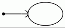  
`diamond` |   
`dot` |   
`icurve` | 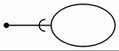  
`inv` |   
`none` |   
`normal` |   
`tee` |   
`vee` |   
  
## Shape Modifiers

As for the modifiers:

`'l'`
    Clip the shape, leaving only the part to the left of the edge.
`'r'`
    Clip the shape, leaving only the part to the right of the edge.
`'o'`
    Use an open (non-filled) version of the shape.

Left and right are defined as those directions determined by looking from the edge towards the point where the arrow "touches" the node.

As an example, the arrow shape `lteeoldiamond` is parsed as `'l' 'tee' 'o' 'l' 'diamond'` and corresponds to the shape:

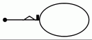

Note that the first arrow shape specified occurs closest to the node. Subsequent arrow shapes, if specified, occur further from the node. Also, a shape of `none` uses space, so, for example, the arrowhead `nonenormal` is not the same as `normal`.

Not all syntactically legal combinations of modifiers are meaningful or semantically valid. For example, none of the modifiers make any sense with `none`. The following table indicates which modifiers are allowed with which shapes.

Modifier | `'l'/'r'` | `o`  
---|---|---  
`box` | ✅ | ✅  
`crow` | ✅ |   
`curve` | ✅ |   
`diamond` | ✅ | ✅  
`dot` |  | ✅  
`icurve` | ✅ |   
`inv` | ✅ | ✅  
`none` |  |   
`normal` | ✅ | ✅  
`tee` | ✅ |   
`vee` | ✅ |   
  
This yields 42 different arrow shapes. The optional second, third, fourth shapes can independently be any of the 42, except the last cannot be `none` as this would create a redundant shape. Thus, there are 41 × 42³ + 41 × 42² + 41 × 42 + 42 = 3,111,696 different combinations.

The following display contains the 42 combinations possible with a single arrow shape. The node attached to the arrow is not drawn but would appear on the right side of the edge.

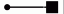 | 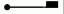 | 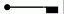 | 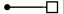 | 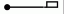 | 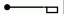  
---|---|---|---|---|---  
box | lbox | rbox | obox | olbox | orbox  
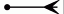 | 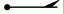 | 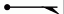  
crow | lcrow | rcrow  
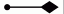 | 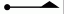 | 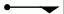 | 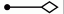 | 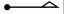 | 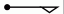  
diamond | ldiamond | rdiamond | odiamond | oldiamond | ordiamond  
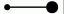 | 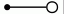  
dot | odot  
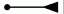 | 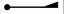 | 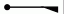 | 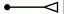 | 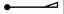 | 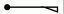  
inv | linv | rinv | oinv | olinv | orinv  
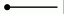  
none  
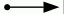 | 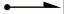 | 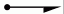 | 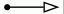 | 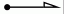 | 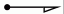  
normal | lnormal | rnormal | onormal | olnormal | ornormal  
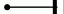 | 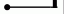 | 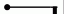  
tee | ltee | rtee  
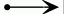 | 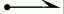 | 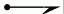  
vee | lvee | rvee  
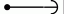 | 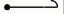 | 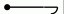 | 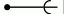 | 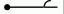 | 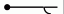  
curve | lcurve | rcurve | icurve | licurve | ricurve  
