# arrowType

Edge arrowhead shape

`normal` |  | `inv` | 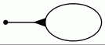
---|---|---|---
`dot` | 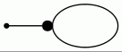 | `invdot` | 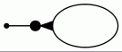
`odot` | 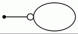 | `invodot` | 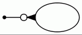
`none` | 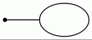 | `tee` | 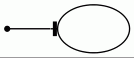
`empty` | 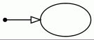 | `invempty` | 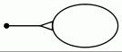
`diamond` | 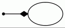 | `odiamond` | 
`ediamond` |  | `crow` | 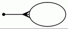
`box` | 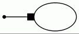 | `obox` | 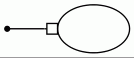
`open` | 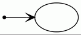 | `halfopen` | 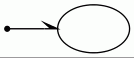
`vee` | 

The examples above show a set of commonly used arrow shapes. There is a grammar of [arrow shapes](../arrow-shapes.md) which can be used to describe a collection of 3,111,696 arrow combinations of the 42 variations of the primitive set of 11 arrows.

The basic arrows shown above contain:

  * most of the primitive shapes (`box`, `crow`, `diamond`, `dot`, `inv`, `none`, `normal`, `tee`, `vee`)
  * shapes that can be derived from the grammar (`odot`, `invdot`, `invodot`, `obox`, `odiamond`)
  * shapes supported as special cases for backward-compatibility (`ediamond`, `open`, `halfopen`, `empty`, `invempty`).

## Attributes

`arrowType` is a valid type for:

  * [arrowhead](../attributes/arrowhead.md)
  * [arrowtail](../attributes/arrowtail.md)
