# colorList

List of (optionally weighted) color values, forming a linear gradient

A colon-separated list of weighted color values: _WC_(:_WC_)* where each _WC_ has the form _C(;F)?_ with C a [color](color.md) value and the optional _F_ a floating-point number, 0 ≤ _F_ ≤ 1. The sum of the floating-point numbers in a `colorList` must sum to at most 1.

**NOTE:** Gradient fills, described below, are currently only available via *CAIRO or SVG rendering.

If the colorList value specifies multiple colors, with no weights, and a filled style is specified, a linear gradient fill is done using the first two colors. If weights are present, a degenerate linear gradient fill is done. This essentially does a fill using two colors, with the weights specifying how much of region is filled with each color. If the [style](../attributes/style.md) attribute contains the value radial, then a radial gradient fill is done. These fills work with any shape.

For certain shapes, the [style](../attributes/style.md) attribute can be set to do fills using more than 2 colors. See the [style](../attributes/style.md) type for more information.

The following table shows some variations of the `yellow:blue` color list depending on the [style](../attributes/style.md) and [gradientangle](../attributes/gradientangle.md) attributes.

See [Gallery/gradient](https://www.graphviz.org/Gallery/gradient/) for real-world examples of using gradients.

Gradient angle | `style=filled` | `style=filled fillcolor="yellow;0.3:blue"` | `style=radial`
---|---|---|---
0 | 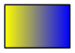 | 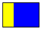 | 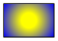
45 | 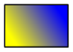 | 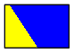 | 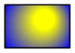
90 | 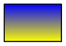 | 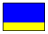 | 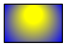
180 | 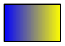 | 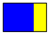 | 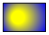
270 | 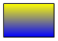 | 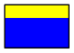 | 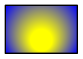
360 |  |  | 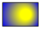

## Attributes

`colorList` is a valid type for:

  * [bgcolor](../attributes/bgcolor.md)
  * [color](../attributes/color.md)
  * [fillcolor](../attributes/fillcolor.md)
