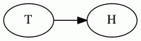
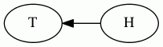
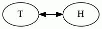
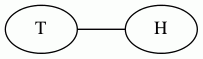

# dirType

Edge arrow direction type

For an edge `T -> H;`

Direction | Image
---|---
`"forward"` | 
`"back"` | 
`"both"` | 
`"none"` | 

That is, a glyph is drawn at the head end of an edge if and only if dirType is `"forward"` or `"both"`; a glyph is drawn at the tail end of an edge if and only if dirType is `"back"` or `"both"`;

For undirected edges `T -- H;`, one of the nodes, usually the righthand one, is treated as the head for the purpose of interpreting `"forward"` and `"back"`.

## Attributes

`dirType` is a valid type for:

  * [dir](../attributes/dir.md)
