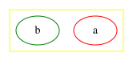

# color

Basic drawing color for graphics, not text

type: [color](../attribute-types/color.md) | [colorList](../attribute-types/colorList.md), default: `black`

For the latter, use the [fontcolor](fontcolor.md) attribute.

For edges, the value can either be a single color or a [colorList](../attribute-types/colorList.md).

In the latter case, if `colorList` has no fractions, the edge is drawn using parallel splines or lines, one for each color in the list, in the order given.

The head arrow, if any, is drawn using the first color in the list, and the tail arrow, if any, the second color. This supports the common case of drawing opposing edges, but using parallel splines instead of separately routed multiedges.

If any fraction is used, the colors are drawn in series, with each color being given roughly its specified fraction of the edge.

For example, the graph:

Edge Color Example

  <button type="button" aria-label="Copy DOT source" title="Copy DOT source" onclick="navigator.clipboard.writeText(this.parentElement.querySelector('code').textContent)" style="position: absolute; top: 0.5rem; right: 0.5rem; z-index: 1; display: inline-flex; align-items: center; justify-content: center; width: 2rem; height: 2rem; padding: 0; border: 1px solid currentColor; border-radius: 0.25rem; background: Canvas; color: CanvasText; cursor: pointer;">
    <svg width="16" height="16" viewBox="0 0 24 24" fill="none" stroke="currentColor" stroke-width="2" stroke-linecap="round" stroke-linejoin="round" aria-hidden="true">
      <rect width="14" height="14" x="8" y="8" rx="2"></rect>
      <path d="M4 16c-1.1 0-2-.9-2-2V4c0-1.1.9-2 2-2h10c1.1 0 2 .9 2 2"></path>
    </svg>
  </button>
  <pre><code class="language-dot">digraph G {
  a -&gt; b [dir=both color="red:blue"]
  c -&gt; d [dir=none color="green:red;0.25:blue"]
}</code></pre>

yields:

Subgraph & Node Color Example

  <button type="button" aria-label="Copy DOT source" title="Copy DOT source" onclick="navigator.clipboard.writeText(this.parentElement.querySelector('code').textContent)" style="position: absolute; top: 0.5rem; right: 0.5rem; z-index: 1; display: inline-flex; align-items: center; justify-content: center; width: 2rem; height: 2rem; padding: 0; border: 1px solid currentColor; border-radius: 0.25rem; background: Canvas; color: CanvasText; cursor: pointer;">
    <svg width="16" height="16" viewBox="0 0 24 24" fill="none" stroke="currentColor" stroke-width="2" stroke-linecap="round" stroke-linejoin="round" aria-hidden="true">
      <rect width="14" height="14" x="8" y="8" rx="2"></rect>
      <path d="M4 16c-1.1 0-2-.9-2-2V4c0-1.1.9-2 2-2h10c1.1 0 2 .9 2 2"></path>
    </svg>
  </button>
  <pre><code class="language-dot">digraph G {
  subgraph cluster_yellow {
    color="yellow"
    a [color="red"]
    b [color="green"]
  }
}</code></pre>

yields:

See also:

  * [colorscheme](colorscheme.md)

_Valid on:_

  * Edges
  * Nodes
  * Clusters
