# Node Shapes

There are three main types of shapes : [polygon-based](#polygon), [record-based](#record) and [user-defined](#epsf).

The record-based shape has largely been superseded and greatly generalized by [HTML-like labels](#html). That is, instead of using `shape=record`, one might consider using `shape=none`, `margin=0` and an HTML-like label.

The geometry and style of all node shapes are affected by the node attributes [fixedsize](attributes/fixedsize.md), [fontname](attributes/fontname.md), [fontsize](attributes/fontsize.md), [height](attributes/height.md), [label](attributes/label.md), [style](attributes/style.md) and [width](attributes/width.md).

## Polygon-based Nodes {#polygon}

The possible polygon-based shapes are displayed below.

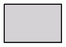
`box`

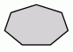
`polygon`

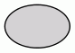
`ellipse`

`oval`

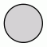
`circle`

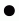
`point`

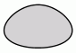
`egg`

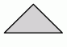
`triangle`

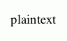
`plaintext`

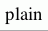
`plain`

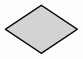
`diamond`

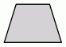
`trapezium`

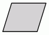
`parallelogram`

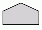
`house`

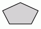
`pentagon`

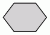
`hexagon`

`septagon`

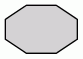
`octagon`

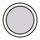
`doublecircle`

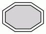
`doubleoctagon`

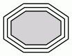
`tripleoctagon`

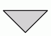
`invtriangle`

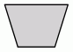
`invtrapezium`

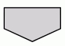
`invhouse`

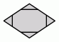
`Mdiamond`

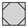
`Msquare`

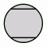
`Mcircle`

`rect`

`rectangle`

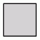
`square`

`star`

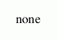
`none`

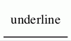
`underline`

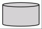
`cylinder`

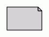
`note`

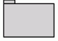
`tab`

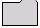
`folder`

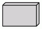
`box3d`

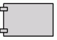
`component`

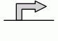
`promoter`

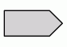
`cds`

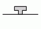
`terminator`

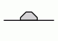
`utr`

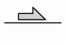
`primersite`

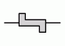
`restrictionsite`

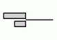
`fivepoverhang`

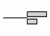
`threepoverhang`

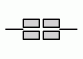
`noverhang`

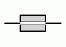
`assembly`

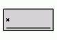
`signature`

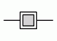
`insulator`

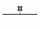
`ribosite`

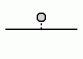
`rnastab`

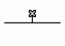
`proteasesite`

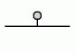
`proteinstab`

`rpromoter`

`rarrow`

`larrow`

`lpromoter`

As the figures suggest, the shapes `rect` and `rectangle` are synonyms for `box`, and `none` is a synonym for `plaintext`. The shape `plain` is similar to these two, except that it also enforces `width=0 height=0 margin=0`, which guarantees that the actual size of the node is entirely determined by the label. This is useful, for example, when using [HTML-like labels](#html). Also, unlike the rest, we have shown these three, as well as `underline`, without `style=filled` to indicate the normal use. If fill were turned on, the label text would appear in a filled rectangle.

The geometries of polygon-based shapes are also affected by the node attributes [regular](attributes/regular.md), [peripheries](attributes/peripheries.md) and [orientation](attributes/orientation.md). If `shape="polygon"`, the attributes [sides](attributes/sides.md), [skew](attributes/skew.md) and [distortion](attributes/distortion.md) are also used. If unset, they default to 4, 0.0 and 0.0, respectively. The point shape is special in that it is only affected by the [peripheries](attributes/peripheries.md), [width](attributes/width.md) and [height](attributes/height.md) attributes.

Normally, the size of a node is determined by smallest width and height needed to contain its label and image, if any, with a margin specified by the [margin](attributes/margin.md) attribute. The width and height must also be at least as large as the sizes specified by the [width](attributes/width.md) and [height](attributes/height.md) attributes, which specify the minimum values for these parameters. See the [fixedsize](attributes/fixedsize.md) attribute for ways of restricting the node size. In particular, if `fixedsize=shape`, the node's shape will be fixed by the [width](attributes/width.md) and [height](attributes/height.md) attributes, and the shape is used for edge termination, but both the shape and label sizes are used preventing node overlap. For example, the following graph:

  <button type="button" aria-label="Copy DOT source" title="Copy DOT source" onclick="navigator.clipboard.writeText(this.parentElement.querySelector('code').textContent)" style="position: absolute; top: 0.5rem; right: 0.5rem; z-index: 1; display: inline-flex; align-items: center; justify-content: center; width: 2rem; height: 2rem; padding: 0; border: 1px solid currentColor; border-radius: 0.25rem; background: Canvas; color: CanvasText; cursor: pointer;">
    <svg width="16" height="16" viewBox="0 0 24 24" fill="none" stroke="currentColor" stroke-width="2" stroke-linecap="round" stroke-linejoin="round" aria-hidden="true">
      <rect width="14" height="14" x="8" y="8" rx="2"></rect>
      <path d="M4 16c-1.1 0-2-.9-2-2V4c0-1.1.9-2 2-2h10c1.1 0 2 .9 2 2"></path>
    </svg>
  </button>
  <pre><code class="language-dot">digraph G {
  { 
    node [margin=0 fontcolor=blue fontsize=32 width=0.5 shape=circle style=filled]
    b [fillcolor=yellow fixedsize=true label="a very long label"]
    d [fixedsize=shape label="an even longer label"]
  }
  a -&gt; {c d}
  b -&gt; {c d}
}</code></pre>

yields the figure:

Note that the label of the yellow node, with `fixedsize=true`, overlaps the other node, where there is sufficient space for the gray node with `fixedsize=shape`.

The shapes: `note`, `tab`, `folder`, `box3d` and `component` were provided by Pander. The synthetic biology shapes: `promoter`, `cds`, `terminator`, `utr`, `primersite`, `restrictionsite`, `fivepoverhang`, `threepoverhang`, `noverhang`, `assembly`, `signature`, `insulator`, `ribosite`, `rnastab`, `proteasesite`, `proteinstab`, `rpromoter`, `rarrow`, `larrow` and `lpromoter` were contributed by Jenny Cheng.

## Record-based Nodes {#record}

**NOTE:** There are problems using non-trivial edges (edges with ports or labels) between adjacent nodes on the same rank if one or both nodes has a record shape.

These are specified by shape values of "record" and "Mrecord". The structure of a record-based node is determined by its [label](attributes/label.md), which has the following schema:

_rlabel_ | = | _field_ ( '|' _field_ )*  
---|---|---  
where _field_ | = | _fieldId_ or '{' _rlabel_ '}'  
and _fieldId_ | = |  [ '<' _string_ '>'] [ _string_ ]  
  
Braces, vertical bars and angle brackets must be escaped with a backslash character if you wish them to appear as a literal character. Spaces are interpreted as separators between tokens, so they must be escaped if you want spaces in the text.

The first string in _fieldId_ assigns a portname to the field and can be combined with the node name to indicate where to attach an edge to the node. (See [portPos](attribute-types/port-pos.md).) The second string is used as the text for the field; it supports the usual [escape sequences](attribute-types/esc-string.md) `\n`, `\l` and `\r`.

Visually, a record is a box, with fields represented by alternating rows of horizontal or vertical subboxes. The Mrecord shape is identical to a record shape, except that the outermost box has rounded corners. Flipping between horizontal and vertical layouts is done by nesting fields in braces "{...}". The top-level orientation in a record is horizontal. Thus, a record with label "A | B | C | D" will have 4 fields oriented left to right, while "{A | B | C | D}" will have them from top to bottom and "A | { B | C } | D" will have "B" over "C", with "A" to the left and "D" to the right of "B" and "C".

The initial orientation of a record node depends on the [rankdir](attributes/rankdir.md) attribute. If this attribute is `TB` (the default) or `BT`, corresponding to vertical layouts, the top-level fields in a record are displayed horizontally. If, however, this attribute is `LR` or `RL`, corresponding to horizontal layouts, the top-level fields are displayed vertically.

As an example of a record node, the dot input:

  <button type="button" aria-label="Copy DOT source" title="Copy DOT source" onclick="navigator.clipboard.writeText(this.parentElement.querySelector('code').textContent)" style="position: absolute; top: 0.5rem; right: 0.5rem; z-index: 1; display: inline-flex; align-items: center; justify-content: center; width: 2rem; height: 2rem; padding: 0; border: 1px solid currentColor; border-radius: 0.25rem; background: Canvas; color: CanvasText; cursor: pointer;">
    <svg width="16" height="16" viewBox="0 0 24 24" fill="none" stroke="currentColor" stroke-width="2" stroke-linecap="round" stroke-linejoin="round" aria-hidden="true">
      <rect width="14" height="14" x="8" y="8" rx="2"></rect>
      <path d="M4 16c-1.1 0-2-.9-2-2V4c0-1.1.9-2 2-2h10c1.1 0 2 .9 2 2"></path>
    </svg>
  </button>
  <pre><code class="language-dot">digraph structs {
    node [shape=record];
    struct1 [label="&lt;f0&gt; left|&lt;f1&gt; mid\ dle|&lt;f2&gt; right"];
    struct2 [label="&lt;f0&gt; one|&lt;f1&gt; two"];
    struct3 [label="hello\nworld |{ b |{c|&lt;here&gt; d|e}| f}| g | h"];
    struct1:f1 -&gt; struct2:f0;
    struct1:f2 -&gt; struct3:here;
}</code></pre>

yields the figure:

If we add the line:
    
    
        rankdir=LR
    

we get the layout:

If we change node `struct1` to have shape `Mrecord`, it then looks like:

## Styles for Nodes

The [style](attributes/style.md) attribute can be used to modify the appearance of a node. At present, there are 8 style values recognized: `filled`, `invisible`, `diagonals`, `rounded`. `dashed`, `dotted`, `solid` and `bold`. As usual, the value of the [style](attributes/style.md) attribute can be a comma-separated list of any of these. If the style contains conflicts (e.g, `style="dotted, solid"`), the last attribute wins.

`filled`
    This value indicates that the node's interior should be filled. The color used is the node's `fillcolor` or, if that's not defined, its `color`. For unfilled nodes, the interior of the node is transparent to whatever color is the current graph or cluster background color. Note that `point` shapes are always filled. 

Thus, the code:

  <button type="button" aria-label="Copy DOT source" title="Copy DOT source" onclick="navigator.clipboard.writeText(this.parentElement.querySelector('code').textContent)" style="position: absolute; top: 0.5rem; right: 0.5rem; z-index: 1; display: inline-flex; align-items: center; justify-content: center; width: 2rem; height: 2rem; padding: 0; border: 1px solid currentColor; border-radius: 0.25rem; background: Canvas; color: CanvasText; cursor: pointer;">
    <svg width="16" height="16" viewBox="0 0 24 24" fill="none" stroke="currentColor" stroke-width="2" stroke-linecap="round" stroke-linejoin="round" aria-hidden="true">
      <rect width="14" height="14" x="8" y="8" rx="2"></rect>
      <path d="M4 16c-1.1 0-2-.9-2-2V4c0-1.1.9-2 2-2h10c1.1 0 2 .9 2 2"></path>
    </svg>
  </button>
  <pre><code class="language-dot">digraph G {
  rankdir=LR
  node [shape=box, color=blue]
  node1 [style=filled] 
  node2 [style=filled, fillcolor=red] 
  node0 -&gt; node1 -&gt; node2
}</code></pre>

yields the figure:

`invisible`
    Setting this style causes the node not to be displayed at all. Note that the node is still used in laying out the graph.
`diagonals`
    The diagonals style causes small chords to be drawn near the vertices of the node's polygon or, in case of circles and ellipses, two chords near the top and the bottom of the shape. The special node shapes [Msquare](#d:Msquare), [Mcircle](#d:Mcircle), and [Mdiamond](#d:Mdiamond) are simply an ordinary square, circle and diamond with the diagonals style set.
`rounded`
    The rounded style causes the polygonal corners to be smoothed. Note that this style also applies to record-based nodes. Indeed, the `Mrecord` shape is simply shorthand for setting this style. Also, prior to 26 April 2005, the rounded and filled styles were mutually exclusive. 

As an example of rounding, dot uses the graph:

  <button type="button" aria-label="Copy DOT source" title="Copy DOT source" onclick="navigator.clipboard.writeText(this.parentElement.querySelector('code').textContent)" style="position: absolute; top: 0.5rem; right: 0.5rem; z-index: 1; display: inline-flex; align-items: center; justify-content: center; width: 2rem; height: 2rem; padding: 0; border: 1px solid currentColor; border-radius: 0.25rem; background: Canvas; color: CanvasText; cursor: pointer;">
    <svg width="16" height="16" viewBox="0 0 24 24" fill="none" stroke="currentColor" stroke-width="2" stroke-linecap="round" stroke-linejoin="round" aria-hidden="true">
      <rect width="14" height="14" x="8" y="8" rx="2"></rect>
      <path d="M4 16c-1.1 0-2-.9-2-2V4c0-1.1.9-2 2-2h10c1.1 0 2 .9 2 2"></path>
    </svg>
  </button>
  <pre><code class="language-dot">digraph R {
  rankdir=LR
  node [style=rounded]
  node1 [shape=box]
  node2 [fillcolor=yellow, style="rounded,filled", shape=diamond]
  node3 [shape=record, label="{ a | b | c }"]

  node1 -&gt; node2 -&gt; node3
}</code></pre>

to produce the figure:

`dashed`
    This style causes the node's border to be drawn as a dashed line.
`dotted`
    This style causes the node's border to be drawn as a dotted line.
`solid`
    This style causes the node's border to be drawn as a solid line, which is the default.
`bold`
    This style causes the node's border to be drawn as a bold line. See also [penwidth](attributes/penwidth.md).

Additional styles may be available with a specific code generator.

## HTML-Like Labels {#html}

**NOTE:** One can use `shape=plain` so that the size of the node is totally determined by the label. Otherwise, the node's margin, width and height values may cause the node to be larger, so that edges are clipped away from the label. In effect, `shape=plain` is shorthand for `shape=none width=0 height=0 margin=0`.

If the value of a label attribute ([label](attributes/label.md) for nodes, edges, clusters, and graphs, and the [headlabel](attributes/headlabel.md) and [taillabel](attributes/taillabel.md) attributes of an edge) is given as an [HTML string](../dot-language.md#html-strings), that is, delimited by `<...>` rather than `"..."`, the label is interpreted as an HTML description. At their simplest, such labels can describe multiple lines of variously aligned text as provided by ordinary [string labels](attribute-types/esc-string.md). More generally, the label can specify a table similar to those provided by HTML, with different graphical attributes at each level.

As [HTML strings](../dot-language.md#html-strings) are processed like HTML input, any use of the `"`, `&`, `<`, and `>` characters in literal text or in attribute values need to be replaced by the corresponding escape sequence. For example, if you want to use `&` in an `href` value, this should be represented as `&amp;`.

**NOTE:** The features and syntax supported by these labels are modeled on HTML. However, there are many aspects that are relevant to Graphviz labels that are not in HTML and, conversely, HTML allows various constructs which are meaningless in Graphviz. We will generally refer to these labels as "HTML labels" rather than the cumbersome "HTML-like labels" but the reader is warned that these are not really HTML. The grammar below describes precisely what Graphviz will accept.

Although HTML labels are not, strictly speaking, a shape, they can be viewed as a generalization of the record shapes described above. In particular, if a node has set its [shape](attribute-types/shape.md) attribute to `none` or `plaintext`, the HTML label will be the node's shape. On the other hand, if the node has any other shape (except `point`), the HTML label will be embedded within the node the same way an ordinary label would be. Adding HTML labels to record-based shapes (record and Mrecord) is discouraged and may lead to unexpected behavior because of their conflicting label schemas and overlapping functionality.

The following is an abstract grammar for HTML labels. Terminals, corresponding to elements, are shown in bold font, and nonterminals in italics. Square brackets `[ and `]` enclose optional items. Vertical bars `|` separate alternatives. Note that, as in HTML, element and attribute names are case-insensitive. (cf. sections 3.2.1 and 3.2.2 of the [HTML 4.01 specification](http://www.w3.org/TR/html401)).

_label_ | : | _text_  
---|---|---  
| | \| | _fonttable_  
_text_ | : | _textitem_  
| | \| | _text_ _textitem_  
_textitem_ | : | _string_  
| | \| | **< BR/>**  
| | \| | **< FONT>** _text_ **< /FONT>**  
| | \| | **< I>** _text_ **< /I>**  
| | \| | **< B>** _text_ **< /B>**  
| | \| | **< U>** _text_ **< /U>**  
| | \| | **< O>** _text_ **< /O>**  
| | \| | **< SUB>** _text_ **< /SUB>**  
| | \| | **< SUP>** _text_ **< /SUP>**  
| | \| | **< S>** _text_ **< /S>**  
_fonttable_ | : | _table_  
| | \| | **< FONT>** _table_ **< /FONT>**  
| | \| | **< I>** _table_ **< /I>**  
| | \| | **< B>** _table_ **< /B>**  
| | \| | **< U>** _table_ **< /U>**  
| | \| | **< O>** _table_ **< /O>**  
_table_ | : | **< TABLE>** _rows_ **< /TABLE>**  
_rows_ | : | _row_  
| | \| | _rows_ _row_  
| | \| | _rows_ **< HR/>** _row_  
_row_ | : | **< TR>** _cells_ **< /TR>**  
_cells_ | : | _cell_  
| | \| | _cells_ _cell_  
| | \| | _cells_ **< VR/>** _cell_  
_cell_ | : | **< TD>** _label_ **< /TD>**  
| | \| | **< TD>** **< IMG/>** **< /TD>**  
  
All non-printing characters such as tabs or newlines are ignored. Above, a _string_ is any collection of printable characters, including spaces. For tables, outside of the body of a [\<TD>](#td) element, whitespace characters are ignored, including spaces; within a [\<TD>](#td) element, spaces are preserved but all other white space characters are discarded. **N.B.** For technical reasons, if a table is wrapped in a font element such as [\](#font) or [\<B>](#b), any space immediately before or after this will cause a syntax error. For example, the label
    
    
    < <U><TABLE><TR><TD>a</TD></TR></TABLE></U>>
    

is not legal. Removing either the space or the `<U>...</U>` will fix this.

HTML comments are allowed within an HTML string. They can occur anywhere provided that, if they contain part of an HTML element, they must contain the entire element.

As is obvious from the above description, the interpretation of white space characters is one place where HTML-like labels is very different from standard HTML. In HTML, any sequence of white space characters is collapsed to a single space, If the user does not want this to happen, the input must use non-breaking spaces `&nbsp;`. This makes sense in HTML, where text layout depends dynamically on the space available. In Graphviz, the layout is statically determined by the input, so it is reasonable to treat ordinary space characters as non-breaking. In addition, ignoring tabs and newlines allows the input text to be formatted for easier reading.

Each of the HTML elements has a set of optional attributes. Attribute values must appear in double quotes.

**Table element**
    
    <TABLE
      ALIGN="CENTER|LEFT|RIGHT"
      BGCOLOR="_color_ "
      BORDER="_value_ "
      CELLBORDER="_value_ "
      CELLPADDING="_value_ "
      CELLSPACING="_value_ "
      COLOR="_color_ "
      COLUMNS="_value_ "
      FIXEDSIZE="FALSE|TRUE"
      GRADIENTANGLE="_value_ "
      HEIGHT="_value_ "
      HREF="_value_ "
      ID="_value_ "
      PORT="_portName_ "
      ROWS="_value_ "
      SIDES="_value_ "
      STYLE="_value_ "
      TARGET="_value_ "
      TITLE="_value_ "
      TOOLTIP="_value_ "
      VALIGN="MIDDLE|BOTTOM|TOP"
      WIDTH="_value_ "
    >
    
**Table row**
    
    <TR
      <!-- No attributes -->
    >
    

**Table cell**
    
    <TD
      ALIGN="CENTER|LEFT|RIGHT|TEXT"
      BALIGN="CENTER|LEFT|RIGHT"
      BGCOLOR="_color_ "
      BORDER="_value_ "
      CELLPADDING="_value_ "
      CELLSPACING="_value_ "
      COLOR="_color_ "
      COLSPAN="_value_ "
      FIXEDSIZE="FALSE|TRUE"
      GRADIENTANGLE="_value_ "
      HEIGHT="_value_ "
      HREF="_value_ "
      ID="_value_ "
      PORT="_portName_ "
      ROWSPAN="_value_ "
      SIDES="_value_ "
      STYLE="_value_ "
      TARGET="_value_ "
      TITLE="_value_ "
      TOOLTIP="_value_ "
      VALIGN="MIDDLE|BOTTOM|TOP"
      WIDTH="_value_ "
    >
    

**Font specification**
    
    
    

**Line break**
    
     
    

**Image inclusion**
    
    
    
**Italic style**
    
    <I
      <!-- No attributes -->
    >
    

**Bold style**
    
    <B
      <!-- No attributes -->
    >
    
**Underline text**
    
    <U
      <!-- No attributes -->
    >
    
**Overline text**
    
    <O
      <!-- No attributes -->
    >
    
**Subscript text**
    
    
    >
    
**Superscript text**
    
    
    >
    
**Strike-through text**
    
    <S
      <!-- No attributes -->
    >
    

**Horizontal rule**
    
    

    />
    

**Vertical rule**
    
    <VR
      <!-- No attributes -->
    />
    

**ALIGN**
    specifies horizontal placement. When an object is allocated more space than required, this value determines where the extra space is placed left and right of the object. 

  * `CENTER` aligns the object in the center. (Default)
  * `LEFT` aligns the object on the left.
  * `RIGHT` aligns the object on the right.
  * ([\<TD>](#td) only) `TEXT` aligns lines of text using the full cell width. The alignment of a line is determined by its (possibly implicit) associated [\ ](#br) element.

The contents of a cell are normally aligned as a block. In particular, lines of text are first aligned as a text block based on the width of the widest line and the corresponding [\ ](#br) elements. Then, the entire text block is aligned within a cell. If, however, the cell's **_ALIGN_** value is `TEXT`, and the cell contains lines of text, then the lines are justified using the entire available width of the cell. If the cell does not contain text, then the contained image or table is centered.

**BALIGN**
    specifies the default alignment of [\ ](#br) elements contained in the cell. That is, if a [\ ](#br) element has no explicit [ALIGN](#align) attribute, the attribute value is specified by the value of **_BALIGN_**.

**BGCOLOR="color"**
    sets the color of the background. This color can be overridden by a **_BGCOLOR_** attribute in descendents. The value can be a single color or two colors separated by a colon, the latter indicating a gradient fill.

**BORDER="value"**
    specifies the width of the border around the object in points. A value of zero indicates no border. The default is 1. The maximum value is 255. If set in a table, and [CELLBORDER](#cellborder) is not set, this value is also used for all cells in the table. It can be overridden by a **_BORDER_** attribute in a cell.

**CELLBORDER="value"**
    specifies the width of the border for all cells in a table. It can be overridden by a [BORDER](#border) tag in a cell. The maximum value is 127.

**CELLPADDING="value"**
    specifies the space, in points, between a cell's border and its content. The default is 2. The maximum value is 255.

**CELLSPACING="value"**
    specifies the space, in points, between cells in a table and between a cell and the table's border. The default is 2. The maximum value is 127.

**COLOR="color"**
    sets the color of the font within the scope of [\...\](#font), or the border color of the table or cell within the scope of [\<TABLE>...\</TABLE>](#table), or [\<TD>...</TD>](#td). This color can be overridden by a **_COLOR_** attribute in descendents. By default, the font color is determined by the [fontcolor](attributes/fontcolor.md) attribute of the corresponding node, edge or graph, and the border color is determined by the [color](attributes/color.md) attribute of the corresponding node, edge or graph.

**COLSPAN="value"**
    specifies the number of columns spanned by the cell. The default is 1. The maximum value is 65535.

**COLUMNS="value"**
    provides general formatting information concerning the columns. At present, the only legal value is `*`, which causes a vertical rule to appear between every cell in every row.

**FACE="fontname"**
    specifies the font to use within the scope of [\...\](#font). This can be overridden by a **_FACE_** attribute in descendents. By default, the font name is determined by the [fontname](attributes/fontname.md) attribute of the corresponding node, edge or graph.

**FIXEDSIZE**
    specifies whether the values given by the [WIDTH](#width) and [HEIGHT](#height) attributes are enforced. 

  * FALSE allows the object to grow so that all its contents will fit. (Default)
  * TRUE fixes the object size to its given [WIDTH](#width) and [HEIGHT](#height). Both of these attributes must be supplied.

**GRADIENTANGLE="value"**
    gives the angle used in a gradient fill if the [BGCOLOR](#bgcolor) is a color list. For the default linear gradient, this specifies the angle of a line through the center along which the colors transform. Thus, an angle of 0 will cause a left-to-right progression. For radial gradients (see [STYLE](#style)), the angle specifies the position of the center of the coloring. An angle of 0 places the center at the center of the table or cell; an non-zero angle places the fill center along that angle near the boundary.

**HEIGHT="value"**
    specifies the minimum height, in points, of the object. The height includes the contents, any spacing and the border. Unless [FIXEDSIZE](#fixedsize) is true, the height will be expanded to allow the contents to fit. The maximum value is 65535.

**HREF="value"**
    attaches a URL to the object. Note that the `"value"` is treated as an [escString](attribute-types/esc-string.md) similarly to the [URL](attributes/url.md) attribute.

**ID="value"**
    allows the user to specify a unique ID for a table or cell. See the [id](attributes/id.md) attribute for more information. Note that the `"value"` is treated as an [escString](attribute-types/esc-string.md) similarly to the [id](attributes/id.md) attribute.

**POINT-SIZE="value"**
    sets the size of the font, in points, used within the scope of `\...\`. This can be overridden by a **_POINT-SIZE_** attribute in descendents. By default, the font size is determined by the [fontsize](attributes/fontsize.md) attribute of the corresponding node, edge or graph.

**PORT="value"**
    attaches a portname to the object. (See [portPos](attribute-types/port-pos.md).) This can be used to modify the head or tail of an edge, so that the end attaches directly to the object.

**ROWS="value"**
    provides general formatting information concerning the rows. At present, the only legal value is `*`, which causes a horizontal rule to appear between every row.

**ROWSPAN="value"**
    specifies the number of rows spanned by the cell. The default is 1. The maximum value is 65535.

**SCALE**
    specifies how an image will use any extra space available in its cell. Allowed values are 

  * `FALSE` : keep image its natural size. (Default)
  * `TRUE` : scale image uniformly to fit.
  * `WIDTH` : expand image width to fill
  * `HEIGHT` : expand image height to fill
  * `BOTH` : expand both image width height to fill If this attribute is undefined, the image inherits the [imagescale](attributes/imagescale.md) attribute of the graph object being drawn. As with the [imagescale](attributes/imagescale.md) attribute, if the cell has a fixed size and the image is too large, any offending dimension will be shrunk to fit the space, the scaling being uniform in width and height if _SCALE=`"true"`_. Note that the containing cell's [ALIGN](#align) and [VALIGN](#valign) attributes override an image's [SCALE](#scale) attribute.

**SIDES="value"**
    specifies which sides of a border in a cell or table should be drawn, if a border is drawn. By default, all sides are drawn. The `"value"` string can contain any collection of the (case-insensitive) characters `'L'`, `'T'`, `'R'`, or `'B'`, corresponding to the left, top, right and, bottom sides of the border, respectively. For example, `SIDES="LB"` would indicate only the left and bottom segments of the border should be drawn.

**SRC="value"**
    specifies the image file to be displayed in the cell. Note that if the software is used as a web server, file system access to images is more restricted. See [SERVER_NAME](../info/command.html#d:SERVER_NAME).

**STYLE**
    specifies style characteristics of the table or cell. Style characteristics are given as a comma or space separated list of style attributes. At present, the only legal attributes are `ROUNDED` and `RADIAL` for tables, and `RADIAL` for cells. If `ROUNDED` is specified, the table will have rounded corners. This probably works best if the outmost cells have no borders, or their [CELLSPACING](#cellspacing) is sufficiently large. If it is desirable to have borders around the cells, use [_**HR**_](#hr) and [_**VR**_](#vr) elements, or the [_**COLUMNS**_](#columns) and [_**ROWS**_](#rows) attributes of [TABLE](#table). 

The `RADIAL` attribute indicates a radial gradient fill. See the [BGCOLOR](#bgcolor) and [GRADIENTANGLE](#gradientangle) attributes.

**TARGET="value"**
    determines which window of the browser is used for the URL if the object has one. See [W3C documentation](http://www.w3.org/TR/html401/present/frames.html#adef-target). Note that the `"value"` is treated as an [escString](attribute-types/esc-string.md) similarly to the [target](attributes/target.md) attribute.

**TITLE="value"**
    sets the tooltip annotation attached to the element. This is used only if the element has a [HREF](#href) attribute. Note that the `"value"` is treated as an [escString](attribute-types/esc-string.md) similarly to the [tooltip](attributes/tooltip.md) attribute.

**TOOLTIP="value"**
    is an alias for [TITLE](#title).

**VALIGN**
    specifies vertical placement. When an object is allocated more space than required, this value determines where the extra space is placed above and below the object. 

  * `MIDDLE` aligns the object in the center. (Default)
  * `BOTTOM` aligns the object on the bottom.
  * `TOP` aligns the object on the top.

**WIDTH="value"**
    specifies the minimum width, in points, of the object. The width includes the contents, any spacing and the border. Unless [FIXEDSIZE](#fixedsize) is true, the width will be expanded to allow the contents to fit. The maximum value is 65535.

There is some inheritance among the attributes. If a table specifies a [_**CELLPADDING**_](#cellpadding), [_**CELLBORDER**_](#cellborder) or [_**BORDER**_](#border) value, this value is used by the table's cells unless overridden. If a cell or table specifies a _**BGCOLOR**_ , this will be the background color for all of its descendents. Of course, if a background or fill color is specified for the graph object owning the label, this will be the original background for the label. The object's fontname, fontcolor and fontsize attributes are the default for drawing text. These can be overridden by using [_**FONT**_](#font) to set new values. The new font values will hold until overridden by an enclosed [_**FONT**_](#font) element. Finally, the pencolor or color of the graph object will be used as the border color.

If you want horizontal or vertical rules used uniformly within a table, consider using the [_**COLUMNS**_](#columns) or [_**ROWS**_](#rows) attributes rather than using many [_**HR**_](#hr) and [_**VR**_](#vr) elements.

Because of certain limitations in handling tables in a device-independent manner, when [_**BORDER**_](#border) is 1 and both table and cell borders are on and [_**CELLSPACING**_](#cellspacing) is less than 2, anomalies can arise in the output, such as gaps between sides of borders which should be abutting or even collinear. The user can usual get around this by increasing the border size or the spacing, or turning off the table border.

### HTML-Like Label Examples

#### Recreating the Record Example

The dot input:

  <button type="button" aria-label="Copy DOT source" title="Copy DOT source" onclick="navigator.clipboard.writeText(this.parentElement.querySelector('code').textContent)" style="position: absolute; top: 0.5rem; right: 0.5rem; z-index: 1; display: inline-flex; align-items: center; justify-content: center; width: 2rem; height: 2rem; padding: 0; border: 1px solid currentColor; border-radius: 0.25rem; background: Canvas; color: CanvasText; cursor: pointer;">
    <svg width="16" height="16" viewBox="0 0 24 24" fill="none" stroke="currentColor" stroke-width="2" stroke-linecap="round" stroke-linejoin="round" aria-hidden="true">
      <rect width="14" height="14" x="8" y="8" rx="2"></rect>
      <path d="M4 16c-1.1 0-2-.9-2-2V4c0-1.1.9-2 2-2h10c1.1 0 2 .9 2 2"></path>
    </svg>
  </button>
  <pre><code class="language-dot">digraph structs {
    node [shape=plaintext]
    struct1 [label=&lt;
&lt;TABLE BORDER="0" CELLBORDER="1" CELLSPACING="0"&gt;
  &lt;TR&gt;&lt;TD&gt;left&lt;/TD&gt;&lt;TD PORT="f1"&gt;mid dle&lt;/TD&gt;&lt;TD PORT="f2"&gt;right&lt;/TD&gt;&lt;/TR&gt;
&lt;/TABLE&gt;&gt;];
    struct2 [label=&lt;
&lt;TABLE BORDER="0" CELLBORDER="1" CELLSPACING="0"&gt;
  &lt;TR&gt;&lt;TD PORT="f0"&gt;one&lt;/TD&gt;&lt;TD&gt;two&lt;/TD&gt;&lt;/TR&gt;
&lt;/TABLE&gt;&gt;];
    struct3 [label=&lt;
&lt;TABLE BORDER="0" CELLBORDER="1" CELLSPACING="0" CELLPADDING="4"&gt;
  &lt;TR&gt;
    &lt;TD ROWSPAN="3"&gt;hello&lt;BR/&gt;world&lt;/TD&gt;
    &lt;TD COLSPAN="3"&gt;b&lt;/TD&gt;
    &lt;TD ROWSPAN="3"&gt;g&lt;/TD&gt;
    &lt;TD ROWSPAN="3"&gt;h&lt;/TD&gt;
  &lt;/TR&gt;
  &lt;TR&gt;
    &lt;TD&gt;c&lt;/TD&gt;&lt;TD PORT="here"&gt;d&lt;/TD&gt;&lt;TD&gt;e&lt;/TD&gt;
  &lt;/TR&gt;
  &lt;TR&gt;
    &lt;TD COLSPAN="3"&gt;f&lt;/TD&gt;
  &lt;/TR&gt;
&lt;/TABLE&gt;&gt;];
    struct1:f1 -&gt; struct2:f0;
    struct1:f2 -&gt; struct3:here;
}</code></pre>

produces the HTML analogue of the record example above:

As usual, an HTML specification is more verbose.

#### More Complex Example

On the other hand, HTML labels are much more general:

  <button type="button" aria-label="Copy DOT source" title="Copy DOT source" onclick="navigator.clipboard.writeText(this.parentElement.querySelector('code').textContent)" style="position: absolute; top: 0.5rem; right: 0.5rem; z-index: 1; display: inline-flex; align-items: center; justify-content: center; width: 2rem; height: 2rem; padding: 0; border: 1px solid currentColor; border-radius: 0.25rem; background: Canvas; color: CanvasText; cursor: pointer;">
    <svg width="16" height="16" viewBox="0 0 24 24" fill="none" stroke="currentColor" stroke-width="2" stroke-linecap="round" stroke-linejoin="round" aria-hidden="true">
      <rect width="14" height="14" x="8" y="8" rx="2"></rect>
      <path d="M4 16c-1.1 0-2-.9-2-2V4c0-1.1.9-2 2-2h10c1.1 0 2 .9 2 2"></path>
    </svg>
  </button>
  <pre><code class="language-dot">digraph G {
  rankdir=LR
  node [shape=plaintext]
  a [
     label=&lt;
&lt;TABLE BORDER="0" CELLBORDER="1" CELLSPACING="0"&gt;
  &lt;TR&gt;&lt;TD ROWSPAN="3" BGCOLOR="yellow"&gt;class&lt;/TD&gt;&lt;/TR&gt;
  &lt;TR&gt;&lt;TD PORT="here" BGCOLOR="lightblue"&gt;qualifier&lt;/TD&gt;&lt;/TR&gt;
&lt;/TABLE&gt;&gt;
  ]
  b [shape=ellipse style=filled
     label=&lt;
&lt;TABLE BGCOLOR="bisque"&gt;
  &lt;TR&gt;
      &lt;TD COLSPAN="3"&gt;elephant&lt;/TD&gt; 
      &lt;TD ROWSPAN="2" BGCOLOR="chartreuse" 
          VALIGN="bottom" ALIGN="right"&gt;two&lt;/TD&gt;
  &lt;/TR&gt;
  &lt;TR&gt;
    &lt;TD COLSPAN="2" ROWSPAN="2"&gt;
      &lt;TABLE BGCOLOR="grey"&gt;
        &lt;TR&gt;&lt;TD&gt;corn&lt;/TD&gt;&lt;/TR&gt; 
        &lt;TR&gt;&lt;TD BGCOLOR="yellow"&gt;c&lt;/TD&gt;&lt;/TR&gt; 
        &lt;TR&gt;&lt;TD&gt;f&lt;/TD&gt;&lt;/TR&gt; 
      &lt;/TABLE&gt;
    &lt;/TD&gt;
    &lt;TD BGCOLOR="white"&gt;penguin&lt;/TD&gt; 
  &lt;/TR&gt; 
  &lt;TR&gt;
    &lt;TD COLSPAN="2" BORDER="4" ALIGN="right" PORT="there"&gt;4&lt;/TD&gt;
  &lt;/TR&gt;
&lt;/TABLE&gt;&gt;
  ]
  c [ 
  label=&lt;long line 1&lt;BR/&gt;line 2&lt;BR ALIGN="LEFT"/&gt;line 3&lt;BR ALIGN="RIGHT"/&gt;&gt;
  ]

  subgraph { rank=same b c }
  a:here -&gt; b:there [dir=both arrowtail=diamond]
  c -&gt; b
  d [shape=triangle]
  d -&gt; c [label=&lt;
&lt;TABLE&gt;
  &lt;TR&gt;
    &lt;TD BGCOLOR="red" WIDTH="10"&gt; &lt;/TD&gt;
    &lt;TD&gt;Edge labels&lt;BR/&gt;also&lt;/TD&gt;
    &lt;TD BGCOLOR="blue" WIDTH="10"&gt; &lt;/TD&gt;
  &lt;/TR&gt;
&lt;/TABLE&gt;&gt;
  ]
}</code></pre>

produces:

#### Fonts Example

An example using [](#font) elements:

  <button type="button" aria-label="Copy DOT source" title="Copy DOT source" onclick="navigator.clipboard.writeText(this.parentElement.querySelector('code').textContent)" style="position: absolute; top: 0.5rem; right: 0.5rem; z-index: 1; display: inline-flex; align-items: center; justify-content: center; width: 2rem; height: 2rem; padding: 0; border: 1px solid currentColor; border-radius: 0.25rem; background: Canvas; color: CanvasText; cursor: pointer;">
    <svg width="16" height="16" viewBox="0 0 24 24" fill="none" stroke="currentColor" stroke-width="2" stroke-linecap="round" stroke-linejoin="round" aria-hidden="true">
      <rect width="14" height="14" x="8" y="8" rx="2"></rect>
      <path d="M4 16c-1.1 0-2-.9-2-2V4c0-1.1.9-2 2-2h10c1.1 0 2 .9 2 2"></path>
    </svg>
  </button>
  <pre><code class="language-dot">digraph structs {
    node [shape=plaintext];

    struct1 [label=&lt;&lt;TABLE&gt;
			&lt;TR&gt;
        &lt;TD&gt;line 1&lt;/TD&gt;
        &lt;TD BGCOLOR="blue"&gt;&lt;FONT COLOR="white"&gt;line2&lt;/FONT&gt;&lt;/TD&gt;
        &lt;TD BGCOLOR="gray"&gt;&lt;FONT POINT-SIZE="24.0"&gt;line3&lt;/FONT&gt;&lt;/TD&gt;
        &lt;TD BGCOLOR="yellow"&gt;&lt;FONT POINT-SIZE="24.0" FACE="ambrosia"&gt;line4&lt;/FONT&gt;&lt;/TD&gt;
        &lt;TD&gt;
          &lt;TABLE CELLPADDING="0" BORDER="0" CELLSPACING="0"&gt;
						&lt;TR&gt;
							&lt;TD&gt;&lt;FONT COLOR="green"&gt;Mixed&lt;/FONT&gt;&lt;/TD&gt;
							&lt;TD&gt;&lt;FONT COLOR="red"&gt;fonts&lt;/FONT&gt;&lt;/TD&gt;
						&lt;/TR&gt;
          &lt;/TABLE&gt;
        &lt;/TD&gt;
      &lt;/TR&gt;
    &lt;/TABLE&gt;&gt;];
}</code></pre>

produces:

#### Images Example

Using an  element:

  <button type="button" aria-label="Copy DOT source" title="Copy DOT source" onclick="navigator.clipboard.writeText(this.parentElement.querySelector('code').textContent)" style="position: absolute; top: 0.5rem; right: 0.5rem; z-index: 1; display: inline-flex; align-items: center; justify-content: center; width: 2rem; height: 2rem; padding: 0; border: 1px solid currentColor; border-radius: 0.25rem; background: Canvas; color: CanvasText; cursor: pointer;">
    <svg width="16" height="16" viewBox="0 0 24 24" fill="none" stroke="currentColor" stroke-width="2" stroke-linecap="round" stroke-linejoin="round" aria-hidden="true">
      <rect width="14" height="14" x="8" y="8" rx="2"></rect>
      <path d="M4 16c-1.1 0-2-.9-2-2V4c0-1.1.9-2 2-2h10c1.1 0 2 .9 2 2"></path>
    </svg>
  </button>
  <pre><code class="language-dot">digraph structs {
    node [shape=plaintext];

    struct1 [label=&lt;&lt;TABLE&gt;
      &lt;TR&gt;&lt;TD&gt;&lt;IMG SRC="eqn.png"/&gt;&lt;/TD&gt;&lt;/TR&gt;
      &lt;TR&gt;&lt;TD&gt;caption&lt;/TD&gt;&lt;/TR&gt;
    &lt;/TABLE&gt;&gt;];
}</code></pre>

produces:

#### Sides Example

The [sides](#sides) attribute (version 2.37 and later) allows one to combine cells to form various non-convex shapes. For example, a `tee-shaped` node

  <button type="button" aria-label="Copy DOT source" title="Copy DOT source" onclick="navigator.clipboard.writeText(this.parentElement.querySelector('code').textContent)" style="position: absolute; top: 0.5rem; right: 0.5rem; z-index: 1; display: inline-flex; align-items: center; justify-content: center; width: 2rem; height: 2rem; padding: 0; border: 1px solid currentColor; border-radius: 0.25rem; background: Canvas; color: CanvasText; cursor: pointer;">
    <svg width="16" height="16" viewBox="0 0 24 24" fill="none" stroke="currentColor" stroke-width="2" stroke-linecap="round" stroke-linejoin="round" aria-hidden="true">
      <rect width="14" height="14" x="8" y="8" rx="2"></rect>
      <path d="M4 16c-1.1 0-2-.9-2-2V4c0-1.1.9-2 2-2h10c1.1 0 2 .9 2 2"></path>
    </svg>
  </button>
  <pre><code class="language-dot">digraph {
  tee [shape=none margin=0 label=
    &lt;&lt;table border="0" cellspacing="0" cellborder="1"&gt;
     &lt;tr&gt;
      &lt;td width="9" height="9" fixedsize="true" style="invis"&gt;&lt;/td&gt;
      &lt;td width="9" height="9" fixedsize="true" sides="ltr"&gt;&lt;/td&gt;
      &lt;td width="9" height="9" fixedsize="true" style="invis"&gt;&lt;/td&gt;
     &lt;/tr&gt;
     &lt;tr&gt;
      &lt;td width="9" height="9" fixedsize="true" sides="tlb"&gt;&lt;/td&gt;
      &lt;td width="9" height="9" fixedsize="true" sides="b"&gt;&lt;/td&gt;
      &lt;td width="9" height="9" fixedsize="true" sides="brt"&gt;&lt;/td&gt;
     &lt;/tr&gt;
    &lt;/table&gt;&gt;]
}</code></pre>

produces:

## User-defined Node Shapes {#epsf}

There is a third type of node shape which is specified by the user. Typically, these shapes rely on the details of a concrete graphics format. At present, shapes can be described using PostScript, via a file or add-on library, for use in PostScript output, or shapes can be specified by a bitmap-image file for use with SVG or bitmap (jpeg, gif, etc.) output. More information can be found on the page [How to create custom shapes](https://www.graphviz.org/faq/#FaqCustShape).

## SDL Shapes for PostScript

One example of user-defined node shapes is provided by Mark Rison of CSR. These are the [SDL](http://www.sdl-forum.org/SDL/index.htm) shapes. These are available as PostScript functions whose use is described in [External PostScript procedures](https://www.graphviz.org/faq/#ext_ps_proc). The necessary PostScript library file and sample use can be found in the `contrib/sdlshapes` directory in the release. Please note the COPYRIGHT AND PERMISSION NOTICE contained in the library file `sdl.ps`.

The table below gives the shape names and the corresponding node shapes:

